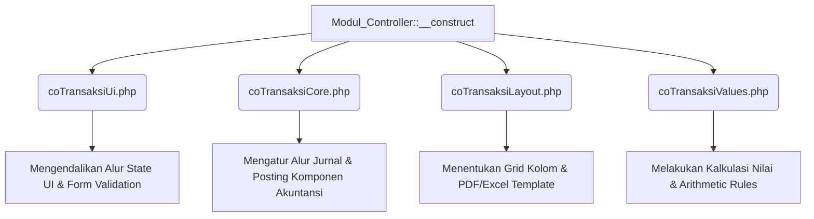

# 📋 Panduan Agens Biaya (Analisis Komprehensif Modul Biaya)
Dokumen ini menyajikan analisis mendalam mengenai struktur, arsitektur, alur data, logika bisnis, serta mekanisme penguncian dan penanganan sesi pada modul transaksi Biaya (`application/modules/biaya`) dalam sistem ERP Everest.

---

## 1. Pendahuluan & Ringkasan Eksekutif
Modul **Biaya** (`application/modules/biaya`) dirancang untuk menangani seluruh spektrum pencatatan pengeluaran, pembebanan biaya operasional, mutasi dana, reimburse kas kecil, payroll, pelunasan utang-piutang, hingga pembebanan biaya produksi dalam sistem ERP. 

Alih-alih mengeras (*hardcoding*) alur akuntansi dan antarmuka untuk setiap jenis pengeluaran, modul ini dibangun di atas **Arsitektur Berbasis Metadata & Konfigurasi**. Setiap transaksi direpresentasikan oleh sebuah kode tipe transaksi (`jenisTr`) yang perilakunya disetir secara dinamis melalui 4 berkas konfigurasi utama.

---

## 2. Arsitektur Berbasis Metadata & Konfigurasi
Modul ini memanfaatkan ekstensi HMVC CodeIgniter 3 dengan base controller [Modul_Controller.php](file:///w:/everest_17jun/application/modules/biaya/controllers/Modul_Controller.php). Saat request masuk, base controller mendeteksi tipe transaksi (`jenisTr`) dari segmen URL dan memuat berkas konfigurasi berikut:



### 📋 4 Konfigurasi Utama Modul Biaya:
1. **[coTransaksiUi.php](file:///w:/everest_17jun/application/modules/biaya/config/coTransaksiUi.php)**
   - Mengatur visualisasi langkah transaksi (langkah 1 = request/draft, langkah 2 = approved, dst.).
   - Mendaftarkan model selector barang/biaya/cabang yang dipanggil via modal pop-up (misal `_selectorItem/selectItem`).
   - Menyimpan schema validator form belanja (`shoppingCartFieldValidators` & `shoppingCartRowValidators`).
2. **[coTransaksiCore.php](file:///w:/everest_17jun/application/modules/biaya/config/coTransaksiCore.php)**
   - Mendefinisikan pemetaan akun akuntansi (GL Jurnal & Buku Besar Pembantu) untuk setiap langkah otorisasi.
   - Mengatur pre-processor (seperti `FifoAverageSupplies` untuk menghitung nilai HPP perlengkapan yang dibebankan).
   - Mendaftarkan post-processor (seperti pengunci stok `LockerStockSupplies` saat draft diajukan).
3. **[coTransaksiLayout.php](file:///w:/everest_17jun/application/modules/biaya/config/coTransaksiLayout.php)**
   - Menyimpan jalur file HTML template kuitansi (seperti `template/762r.html` untuk slip gaji atau `template/676.html` untuk biaya produksi).
   - Menentukan kolom yang tampil pada tabel ringkasan transaksi, laporan excel, serta bukti cetak.
4. **[coTransaksiValues.php](file:///w:/everest_17jun/application/modules/biaya/config/coTransaksiValues.php)**
   - Mengatur formula matematis (misal: `jml * harga`) untuk menghitung akumulasi biaya baris belanja secara presisi.

---

## 3. Katalog Transaksi & Logika Bisnis (`jenisTr`)
Berikut adalah daftar tipe transaksi yang dikelola di bawah modul Biaya beserta alur bisnisnya:

| Kode `jenisTr` | Nama Transaksi | Deskripsi & Aturan Bisnis Utama |
| :--- | :--- | :--- |
| **`2676` / `676`** | **Biaya Produksi** | Pencatatan pengeluaran langsung untuk proses manufaktur. Sistem akan membebankan biaya produksi ke rekening COA `6020`, serta mencatat rincian alokasi biaya per item ke buku pembantu komposisi biaya produksi (`RekeningPembantuBiayaKomposisiProduksi`). |
| **`7762` / `2762`** | **Pembiayaan Supplies** | Pembebanan perlengkapan kantor/gudang (supplies) yang keluar dari stok menuju kategori biaya. Menggunakan pre-processor `FifoAverageSupplies` untuk menilai harga perolehan supplies berdasarkan antrean FIFO keluar-masuk barang secara otomatis. |
| **`677` / `2677`** | **Biaya Usaha Cabang** | Pengajuan biaya operasional oleh cabang (kasir). Langkah 1 berupa *request* (status hold/pending), langkah 2 berupa *approval* oleh otorisator finansial pusat sebelum nilai dibebankan ke jurnal pembukuan. |
| **`1677`** | **Biaya Usaha Pusat** | Pengeluaran operasional tingkat holding/kantor pusat. |
| **`1674` / `11674`**| **Reimburse Kas Kecil** | Alur pengembalian uang (reimbursement) kas kecil internal cabang berdasarkan pengumpulan nota pengeluaran kecil. |
| **`21674`** | **Reimburse Kas Kecil Eksteral** | Reimburse kas kecil yang melibatkan pihak ketiga di luar cabang. |
| **`7674`** | **Pengisian Kembali Kas Kecil**| Proses replenishment (top-up) kas kecil cabang yang dikirim dari kas utama pusat/rekening bank pusat. |
| **`675` / `2675`** | **Mutasi Kas** | Pemindahan dana antar-akun kas fisik di dalam perusahaan. |
| **`1675` / `4675`** | **Mutasi Bank** | Pemindahan dana antar-rekening bank perusahaan. |
| **`762`** | **Biaya Gaji (Payroll)** | Pencatatan slip gaji karyawan cabang. Menghubungkan COA biaya gaji dengan potongan BPJS dan PPH21 secara terintegrasi melalui sub-ledger `RekeningPembantuBiayaGaji`. |
| **`9982` s/d `9985`**| **Pelunasan Nota Hutang** | Penyelesaian kewajiban utang (Account Payable) kepada supplier menggunakan instrumen Kas (`9982`), Bank (`9983`), Deposit/Cashback (`9984`), maupun Giro (`9985`). |
| **`9922`** | **Pelunasan Nota Piutang** | Penerimaan pembayaran dari pelanggan (Account Receivable) untuk melunasi nota penjualan kredit. |
| **`119`** | **Biaya Penyusutan** | Jurnal otomatis berkala untuk pengakuan depresiasi aset tetap berwujud/tidak berwujud berdasarkan masa manfaatnya. |
| **`742` / `743`** | **Selisih Stock Opname** | Pengakuan biaya/kerugian akibat selisih kurang stok (`742`) atau pengakuan pendapatan dari selisih lebih stok (`743`) yang ditemukan pasca audit fisik. |
| **`2674` / `3674`** | **Mutasi Kas Kecil Antar Cabang**| Transfer dana kas kecil antar entitas cabang yang membutuhkan otorisasi penerimaan dari cabang tujuan. |
| **`6677` / `16677`**| **Cashback Penjualan (Biaya)** | Pengajuan pengeluaran biaya cashback penjualan kepada konsumen baik di cabang (`6677`) maupun otorisasi terpusat di holding (`16677`). |

---

## 4. Struktur Database & Alur Data
Penyimpanan data pada modul biaya terbagi menjadi dua bagian: Relational Database (MariaDB/MySQL) untuk struktur data transaksi terstruktur, dan NoSQL (MongoDB) untuk log audit dinamis.

### 🗄️ Entitas Tabel Relational (MySQL):
1. **`transaksi`**: Menyimpan header transaksi utama (seperti `nomer`, `dtime`, `cabang_id`, `oleh_id`, `transaksi_nilai`, dan status otorisasi).
2. **`transaksi_values`**: Menyimpan agregasi hitungan nilai finansial (misal nilai PPN, net, gross, dsb.).
3. **`transaksi_data`**: Menyimpan data baris (rincian item pengeluaran/barang belanja).
4. **`transaksi_data_values`**: Menyimpan nilai moneter per baris item belanja.
5. **`transaksi_sign`**: Menyimpan data verifikasi tanda tangan / persetujuan otorisasi digital user per langkah.
6. **`transaksi_extstep`**: Menyimpan langkah otorisasi kustom tambahan di luar langkah dasar.
7. **`transaksi_data_registry`** (sebelumnya `transaksi_registry`): Registrasi audit log status transaksi (Hold -> Request -> Approved -> Closed).

---

## 5. Logika Concurrency & Mekanisme Pengunci (Locker)
Modul biaya dilengkapi dengan penanganan konkurensi data yang ketat untuk mencegah *double-payment* atau modifikasi paralel:

### 🔒 Pengunci Transaksi Ganda (`MdlLockerTransaksi`)
- Saat pengguna mengedit atau memproses transaksi penting, sistem akan membuat entri kunci (`state = 'hold'`, `jumlah = '1'`) di bawah ID pengguna aktif.
- Jika pengguna lain mencoba mengakses transaksi yang sedang dikunci, sistem akan memblokir akses dan menampilkan halaman **"Transaksi Terkunci"** lengkap dengan detail perangkat dan waktu aktivitas petugas pertama.

### ⏱️ Mekanisme Ambil Alih Transaksi (Petugas Idle)
- Jika petugas pertama tidak melakukan aktivitas apa pun (idle) selama **minimal 5 menit**, tombol **"Ambil Alih Transaksi (Petugas Idle)"** akan aktif pada layar pengguna kedua.
- Jika diklik dengan parameter `?forceRetakeLock=1`, sistem akan melepaskan hold petugas pertama (`jumlah = 0` via library `ComLockerTransaksi`) dan mengalihkan kendali kunci ke petugas baru.
- **Pembersihan Sesi Logout**: Hold locker transaksi milik pengguna akan dibersihkan secara sadar oleh sistem (`$lls->normalisasiStok(true)`) sesaat setelah pengguna menekan tombol **Logout** manual.

---

## 6. Sesi & Stabilitas Perangkat Scanner (Mobile/Tablet)
Bagi pengguna yang memproses persetujuan supplies atau transaksi biaya di lapangan menggunakan perangkat mobile/scanner, sistem menerapkan aturan stabilitas sesi berikut:

### ❌ Larangan Penggunaan `<iframe>`
- Untuk menghindari pemblokiran cookie session (`PHPSESSID`) oleh mekanisme **ITP (Intelligent Tracking Prevention)** pada peramban Apple Safari (iOS/iPadOS), modul biaya **dilarang keras** menggunakan iframe tersembunyi untuk otentikasi mobile.

### 🔄 Alur Redirect Berantai Mobile
- Sesi scanner dibangun menggunakan redirect langsung (`location.href`) di jendela utama browser dengan rantai urutan berikut:

```
Akses URL followupDariHp?ismob=1
    │
    ├─► [Sesi Belum Login?] ──► Redirect ke: createSimpleSessionLogin
    │                                              │
    │                                              ▼
    ├─► [Mode Mobile Belum Aktif?] ──► Redirect ke: auth/Login/forceMobile
    │                                              │
    │                                              ▼
    └─► [Semua Siap] ──► Render Halaman Akhir: FollowUp::followupPrePreview
```

### 🛑 Penanganan Sesi Habis (Expired Session)
- Apabila sesi scanner habis, helper `gotoLogin()` akan mendeteksi asal request scanner (melalui parameter `ismob=1` atau URL referer scanner) dan menampilkan **halaman HTML khusus "Sesi Habis"** dengan tombol manual **"Mulai Ulang Sesi"** (tanpa pengatur waktu mundur otomatis). Tombol ini akan mengulangi alur redirect berantai untuk memulihkan sesi dari basis data.

---

## 7. Sistem Posting Jurnal Akuntansi Ganda (Double-entry Ledger)
Proses penjurnalan otomatis tidak ditulis secara manual di dalam controller, motode melainkan dievaluasi secara dinamis saat transaksi mencapai status final (`approved`).

Ketika `FollowUp::doFollowup()` dipanggil:
1. Helper `evaluateComponents_he_menu` membaca kunci `"components"` pada `coTransaksiCore.php` milik `jenisTr` terkait.
2. Jurnal dasar dibuat dengan memanggil model [ComJurnal.php](file:///w:/everest_17jun/application/models/Coms/ComJurnal.php) dan [ComRekening.php](file:///w:/everest_17jun/application/models/Coms/ComRekening.php) untuk mencatat sisi Debet dan Kredit.
3. Buku pembantu pembukuan (`RekeningPembantu*`) yang spesifik diupdate sesuai dengan entitas detail transaksi:
   - Pengeluaran biaya usaha cabang akan masuk ke [ComRekeningPembantuBiayaUsahaMain.php](file:///w:/everest_17jun/application/models/Coms/ComRekeningPembantuBiayaUsahaMain.php).
   - Pengeluaran supplies akan mengurangi nilai pembantu supplies di [ComRekeningPembantuSupplies.php](file:///w:/everest_17jun/application/models/Coms/ComRekeningPembantuSupplies.php) menggunakan hitungan FIFO.
   - Utang biaya ke pusat atau cabang lain akan diposting ke [ComRekeningPembantuBiayaHarusDibayar.php](file:///w:/everest_17jun/application/models/Coms/ComRekeningPembantuBiayaHarusDibayar.php) atau [ComRekeningPembantuAntarcabang.php](file:///w:/everest_17jun/application/models/Coms/ComRekeningPembantuAntarcabang.php).

Desain terkonfigurasi ini memastikan integritas mutlak pencatatan keuangan ganda tanpa risiko inkonsistensi data antar tabel transaksi dengan buku besar pembukuan akuntansi.

---

## 8. Logika Bisnis & Jenis-jenis Cashback Penjualan
Modul Biaya mengelola transaksi cashback penjualan secara rinci melalui konfigurasi `jenisTr` **`6677`** (Cabang) dan **`16677`** (Pusat). Di dalam formulir belanja (*shopping cart*), terdapat opsi penentuan jenis kompensasi cashback (`type_cashback` / `jenisCashback`) dengan aturan sebagai berikut:

1. **Cashback Tunai / Kas / Credit Note (`type_cashback` == "cash")**
   - Nilai cashback diberikan langsung dalam bentuk kas fisik atau dijadikan pengurang piutang konsumen (Credit Note).
   - Dijurnal langsung ke akun Beban Usaha / Beban Penjualan (`6010` untuk cabang atau `6140` untuk project) di sisi debet, dan akun Kas/Bank/Piutang di sisi kredit.

2. **Cashback Barang / Valas / Logam Mulia (`type_cashback` == "barang")**
   - Nilai cashback dikonversi ke dalam instrumen valuta asing (valas) atau emas/logam mulia.
   - Konfigurasi menggunakan parameter `shoppingCartCashbackAdd` dengan model rujukan [MdlCurrency](file:///w:/everest_17jun/application/models/MdlCurrency.php) (misal via selector `_processPihak/selectValas`).

3. **Cashback Produk (`type_cashback` == "produk")**
   - Konsumen menerima cashback dalam bentuk produk fisik dari inventaris.
   - Menggunakan konfigurasi `shoppingCartCashbackAddProduct` dengan model rujukan [MdlProduk](file:///w:/everest_17jun/application/models/MdlProduk.php) (via selector `_prosesSelectProduk/select`).
   - Sistem akan memotong persediaan produk tersebut dan membebankannya sebagai biaya cashback penjualan.

### 8.4 Pengecekan Kondisional Bertingkat (Expression-Based Conditions) pada `relativeElements`
Untuk menangani situasi di mana render elemen bergantung pada kombinasi kondisi beberapa elemen input (contoh: elemen `cash_account_source` hanya tampil jika `freelancerOption == 1` DAN `selectMetodcasback == 3`), diimplementasikan metode evaluasi ekspresi logika dinamis (*Expression DSL*):
- **Struktur Config:**
  ```php
  "relativeElements" => array(
      "freelancerOption == 1 && selectMetodcasback == 3" => array(
          "cash_account_source" => array(
              "elementType" => "dataModel",
              "inputType" => "radio",
              "label" => "tunai / akun bank (penerimaan uang untuk pembayaran pajak)",
              // ... parameter model ...
          )
      )
  )
  ```
- **Evaluator Helper:**
  Helper mengevaluasi ekspresi logika ini secara aman melalui parser ekspresi di `he_element_helper.php`. Jika ekspresi dievaluasi dan tidak terpenuhi (`false`), elemen tidak akan dirender. Jika ekspresi tidak menggunakan operator (format lama), sistem akan menggunakan pencocokan default untuk menjaga kompatibilitas ke belakang (*backward compatibility*).

---
> [!NOTE]  
> Seluruh pengembangan atau modifikasi pada modul Biaya wajib mematuhi panduan arsitektur metadata di atas serta menjaga kompatibilitas penuh dengan PHP 5.6.
